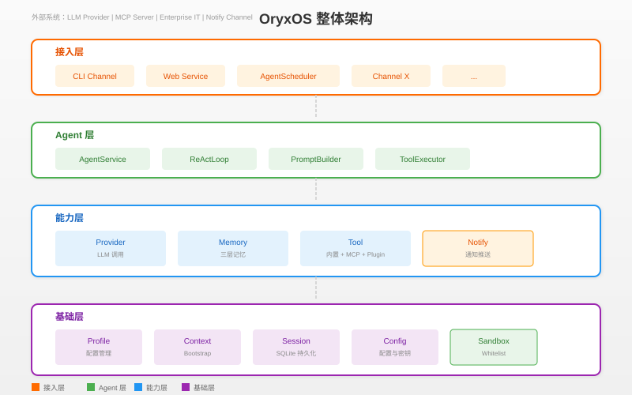

# OryxOS

<p align="center">
  
</p>

<p align="center">
  企业级 Agent OS · Java 21 · Spring Boot 3.x · 自实现 ReAct Loop
</p>

<p align="center">
  <a href="#-核心特性">核心特性</a> ·
  <a href="#-架构图">架构图</a> ·
  <a href="#-快速开始">快速开始</a> ·
  <a href="#-模块说明">模块说明</a> ·
  <a href="#-文档">文档</a> ·
  <a href="#license">License</a>
</p>

---

## 🔑 核心特性

### 五大核心能力

| 能力 | 说明 |
|------|------|
| **对接 LLM** | 通过 Provider 抽象层对接主流大模型（DeepSeek、通义、Kimi、智谱等），Agent 不感知具体调的是哪家 |
| **ReAct 循环** | Agent 的核心工作机制，LLM 思考是否调用工具、调用后看结果、再决定下一步 |
| **Memory 三层记忆** | 会话记忆 + 长期记忆（MEMORY.md）+ 情景记忆（扩展阶段） |
| **Plugin Tool** | 内置 9 个 Tool + 三档 Plugin 扩展（零代码/轻代码/重代码） |
| **Web Service** | 完整 REST API，业务系统通过 HTTP 接入 |

### 技术亮点

- **JDK 21 + Spring Boot 3.x**：企业级技术栈，运维体系无缝对接
- **自实现 ReAct Loop**：完全可控，不依赖 Spring AI 自动执行
- **单二进制部署**：装好就跑，不锁任何云生态
- **SQLite 持久化**：审计数据 day one 落库
- **沙箱安全隔离**：应用层白名单校验

---

## 🏗 架构图



---

## 🚀 快速开始

### 环境要求

- JDK 21+
- Maven 3.9+

### 构建

```bash
mvn clean package
```

### 初始化工作区

```bash
java -jar oryxos-boot/target/oryxos-boot-*.jar init
```

### 启动服务

```bash
java -jar oryxos-boot/target/oryxos-boot-*.jar serve
```

### 交互对话

```bash
java -jar oryxos-boot/target/oryxos-boot-*.jar chat
```

### 一键启动（Linux/macOS）

```bash
./bin/start.sh
```

---

## 📦 模块说明

| 模块 | 说明 |
|------|------|
| `oryxos-core` | 核心抽象：OryxTool、Session、Profile、ReActLoop、AgentService |
| `oryxos-provider` | LLM Provider 抽象层 |
| `oryxos-memory` | Memory 三层记忆 |
| `oryxos-tool` | 内置 Tool、MCP Client、Sandbox |
| `oryxos-channel-cli` | CLI 交互 Channel |
| `oryxos-web` | REST API 服务 |
| `oryxos-storage` | SQLite 持久化层 |
| `oryxos-cli` | Picocli 命令行工具 |
| `oryxos-boot` | Spring Boot 启动模块 |

---

## 📖 文档

| 文档 | 说明 |
|------|------|
| [需求文档](docs/DemandAnalysis.md) | 功能需求和非功能需求 |
| [技术方案](docs/TechnicalSolution.md) | 技术架构和实现细节 |
| [业界调研](docs/IndustryResearch.md) | Agent OS 市场分析 |
| [AI 编程指南](docs/AiProgrammingGuide.md) | Spec-Kit 实施指引 |
| [课程文档](docs/class/) | 详细课程讲义 |

---

## 🌐 官网

- 文档：https://oryxos.snake-java.com/
- GitHub：https://github.com/snake-java/oryxos

---

## License

MIT License
